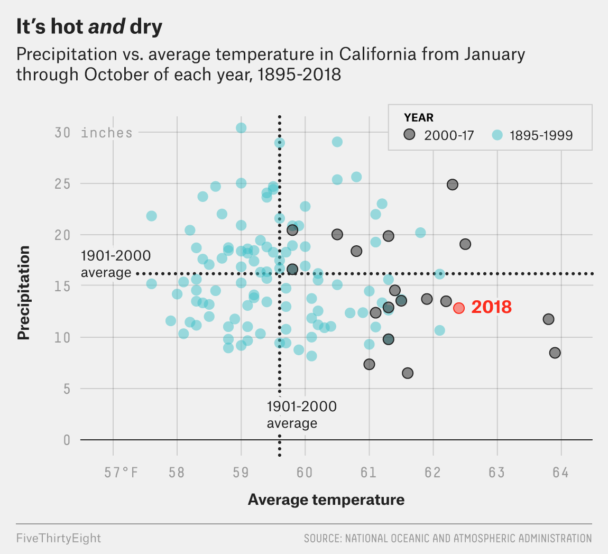
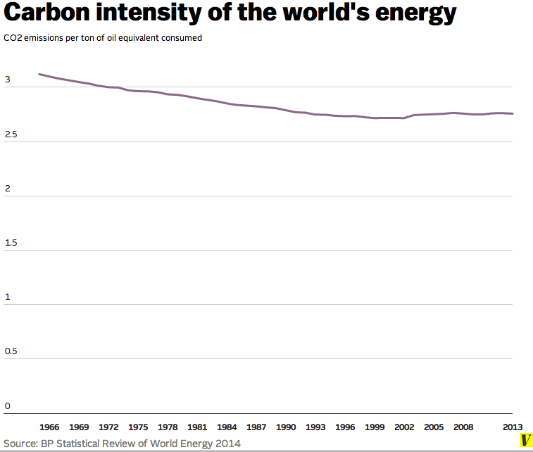
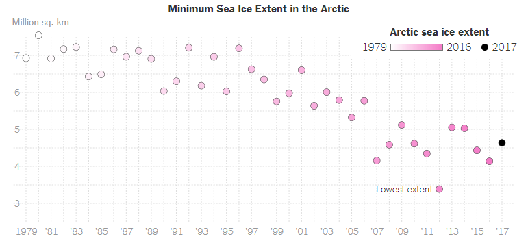
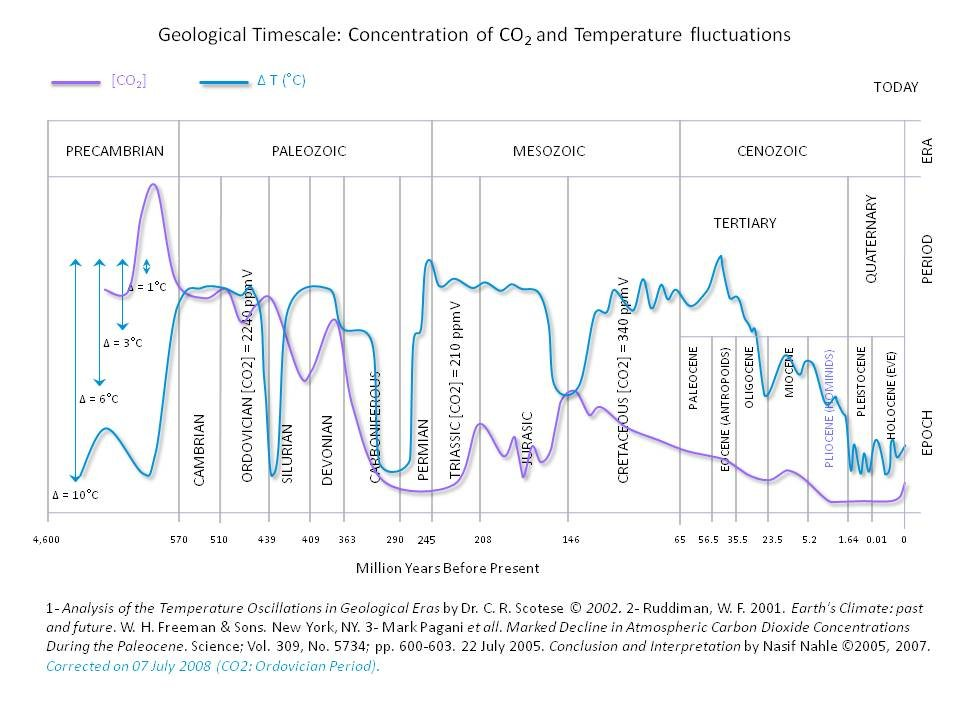

# Background

I have collected five different visualizations on climate change from across the internet and will evaluate the charts using a framework I have outlined below.

### Evaluation framework

For this project, I'll be using an evaluation framework based on a number of blog posts and papers that I have read online [here](https://www.elsevier.com/connect/a-5-step-guide-to-data-visualization), [here](https://research.tableau.com/sites/default/files/Kosara-C4PGV-2016.pdf), and [here](https://medium.com/@Elijah_Meeks/data-visualization-fast-and-slow-d2653d4850b0).

After reading these articles a couple of times, I will be evaluating my collected visualizations based on the following criteria:

* Does the visualization **draw interest**?
* Is the visualization free from bias (i.e. it leaves the audience enough emphasis as a starting point)?
* Is the message of the visualization explicit enough?
* Are labels descriptive and aid in understanding the data?
* Does the visualization require context (of a specific audience or understanding)?
* Does the visualization provide additional insight?
* And finally, am I, as the audience, instilled to *take action* or *instill change*?

Additionally, I will be evaluating these visualizations based off these criteria alone and will do my best to separate any predisposed judgements I may or may not have regarding climate change.

### Visualizations

1. *Why California's Wildfires Are So Destructive in Five Charts*, FiveThirtyEight 

 
 
Up first, we see a scatterplot outlining the change in precipitation and average temperatures in California across time. At first glance, the chart is visually attractive, with simple, clean lines and a title that basically tells the main message of the chart (that California is both hot and dry).

The chart is very factual, as it only displays the recorded temperatures in the state of CA. However, it emphasizes the data from 2000 - 2017 and contrasts it against the average temperature of the 20th century. It also emphasizes the most recent temperature of the year 2018 to show where the state is currently at. 

Overall, I think this is a very well designed chart that argues for climate change, since it doesn't have any bias for or against climate change, simply and effectively tells the facts, and emphasizes the right data in order to give enough context for the audience reading. 

2. Vox.com

 
 
I have some issues with this visualization, but let's look at the pros first. At first glance, the visualization is very simply designed - minimalist and visually clean. It has very clear axis labels and a title that grabbed my attention. I knew right away that it's telling a story about carbon emissions globally and what measure is being used.

However, unlike the previous graph, this chart is not visually stimulating. It's just a line graph over time. What bothered me the most was that the line looks like it barely moved over 40 years. This could have been easily fixed with a different y-axis scale. To someone who is out of context, it begs the question of 'so what?'. 

Compared to the last visualization, this chart doesn't make me want to change my behavior of wanting to use or drive less to help reduce carbon emissions - instead, it makes me wonder if what I do will change anything at all!

3. NASA

 
 
I'm a fan of NASA - don't get me wrong, they're a great organization doing great things for humanity. But also a fan of easily readable visualizations. This, unfortunately, is not. 

It's missing a title, the background looks messy, and there's lots of room for improvement on this chart. Yes, the viz drew some interest, it has a clear message, and it makes me rethink my own consumption habits, be it using plastic bags or driving my car, but the general design of the viz is drawing attention away from the message.

I believe this viz could have been improved if it were presented more cleanly, without the gridlines, and instead with a clear title that influences the audience to reduce carbon emissions (and that it needs to be done *fast*).

4. New York Times

 
 
I believe this is an example of a good visualization for climate change. What I like so much about it is that the Times chose a topic which has not yet been touched by the other viz I have used - polar ice caps. Immediately, I am drawn to the viz since it's about a topic that doesn't get much love (in comparison to carbon emissions). 

It uses a very clean layout with axis labels that are legible and very easily understood. The choice of using a scatter plot is also very good as it gives a snapshot in time while drawing an imaginary downward trend line over time. The use of minimum sea ice measures is also interesting, since it shows a stronger effect of climate change on polar ice cap levels.

My critique on this chart would be that the color gradient used on the scatter dots are weird - why use a gradient color when you could have used a method similar to that of the Vox.com (2) viz instead? I believe if they threw in an average measure to compare to, the audience would receive a stronger message that causes change. Furtheremore, you could also argue the measurements might have been inconsistent over time (i.e. the chart does not explicitly say during what periods of the year were the measurements taken).

5. Reddit's r/climateskeptics

 
 
Finally, we have arrived to the dark side. This viz took me a while to find since not many online communities I frequent believe that climate change is a government hoax. This viz was lifted from a whitepaper on geological carbon records over time (read: estimates of carbon from a very long time ago). For context, this graph was used in an argument that carbon emissions and global temperatures at an all-time low on a geological time scale.

I'll start with the pros: This is a very well-designed chart. It's message is clear with the title summing up what the chart is saying - that carbon dioxide levels and global temperatures fluctuated over time since millions of years ago. The axes are split up into legible eras, although some areas of the viz are a little cluttered, but I'll allow that. The choice of using smoothed, averaged-out lines are also good since it makes the lines cleaner (unlike Tesla's daily stock price). To be honest, I quite like this viz. It tells me a story, it's visually pleasing, I understand the source fhte data (with reference!) and it makes me want to explore for rocks to look at.

However, the only fault I can find in this viz is that it is easily taken out of context, particularly in communities skeptical of climate change. The chart was obviously designed for an audience that is "in-the-know" (geologists studying Earth's climate millions of years ago). Unlike the previous 4 charts we've seen, this one is for a very niche group of people that are always putting things under a microscope to measure very subtle details. If taken out of context and into the eyes of the public, one might use this in a very nefarious way to justify climate change is not real. This graph needs additional context to combat that confusion. I believe it can be easily done by adding a disclaimer or additional information about the caveats of using this data to compare to real temperatures of current times.

### References

https://www.elsevier.com/connect/a-5-step-guide-to-data-visualization 

https://research.tableau.com/sites/default/files/Kosara-C4PGV-2016.pdf 

https://medium.com/@Elijah_Meeks/data-visualization-fast-and-slow-d2653d4850b0 

https://fivethirtyeight.com/features/why-californias-wildfires-are-so-destructive-in-5-charts/ 

https://www.vox.com/2014/6/19/5821250/these-5-charts-show-why-the-world-is-still-failing-on-climate-change 

https://www.reddit.com/r/climateskeptics/comments/2hgj3u/geological_timescale_chart_of_co%C2%B2_concentration/ 

https://climate.nasa.gov/evidence/ 

https://www.nytimes.com/2019/02/28/learning/teach-about-climate-change-with-these-24-new-york-times-graphs.html 

